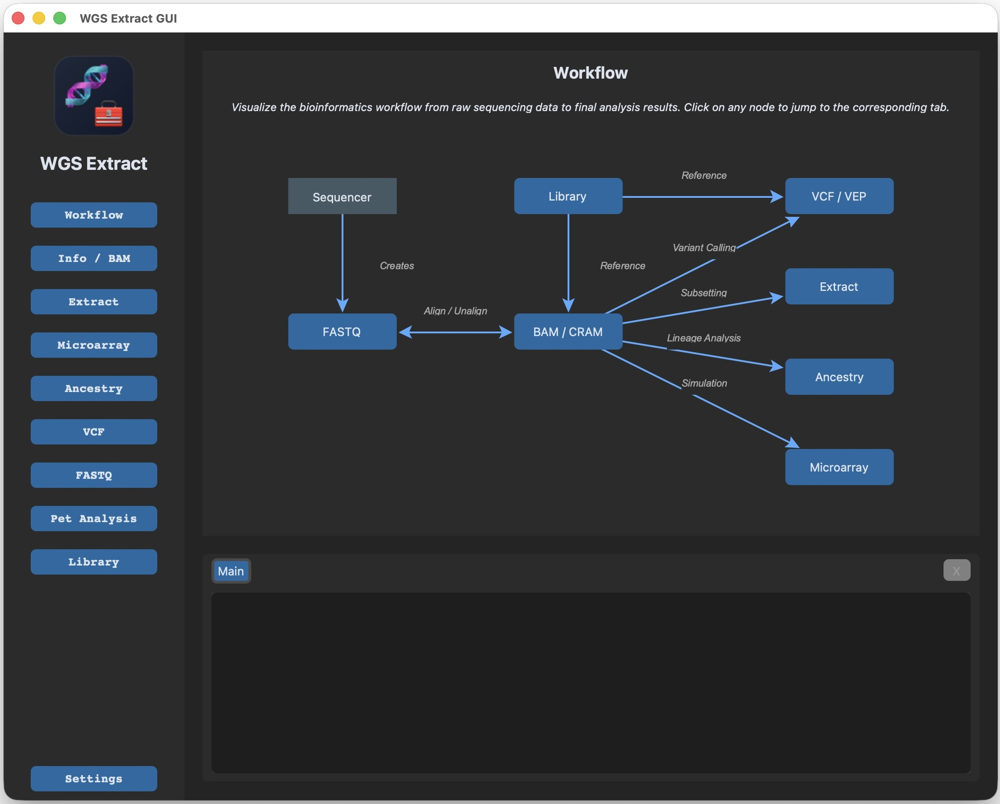

> [!WARNING]
> A bit rough around the edges but I use it locally myself.  An AI agent can probably patch over any rough spots for you.

# 🧬 WGS Extract CLI (`wgsextract-cli`)



[](https://www.gnu.org/licenses/gpl-3.0)
[](https://www.python.org/downloads/)
[](https://github.com/astral-sh/ruff)

A completely independent, modern, AI-optimized command-line recreation of the [WGS (Whole Genome Sequencing) Extract](https://github.com/WGSExtract/WGSExtract-Dev/) application. 

Designed to be CLI-first for AI-friendliness, `wgsextract-cli` leverages [**Pixi**](https://pixi.sh) to provide a consistent, cross-platform environment for both Python and external bioinformatics tools (like samtools and bcftools).


## ⚙️ Installation & Setup Guide

`wgsextract-cli` has a self-contained macOS/Linux installer based on [**Pixi**](https://pixi.sh), which manages Python, bioinformatics tools, and the application environment. Open the Terminal app on your machine, paste this command, and press Enter:

```bash
curl -fsSL https://raw.githubusercontent.com/theontho/wgsextract-cli/main/install.sh | sh
```

The command downloads the small bootstrap script from `main`, but the app payload is not installed from `main`. The installer resolves GitHub's latest published release, downloads that release tag's source archive, runs `pixi install`, and writes launchers inside the install directory. This keeps normal installs on tested release builds while allowing the install command itself to improve over time.

By default, a downloaded `install.sh` creates `wgsextract-cli/` next to itself; when run through `curl | sh`, it creates `wgsextract-cli/` in the current directory. The app lives in `wgsextract-cli/app/`, the CLI launcher lives at `wgsextract-cli/wgsextract`, Pixi files live under `wgsextract-cli/.pixi/`, and installer temporary files live under `wgsextract-cli/app/tmp/`. On macOS, the installer opens the install directory in Finder when it finishes. Remove the app with `wgsextract-cli/uninstall.sh`; interactive uninstalls ask whether to remove Pixi from `~/.pixi` too.

After install, the default launchers are:

| Launcher | Purpose |
| :--- | :--- |
| `wgsextract-cli/wgsextract` | CLI launcher |
| `wgsextract-cli/WGS Extract GUI.command` | macOS Finder double-click launcher for the desktop GUI |
| `wgsextract-cli/start-wgsextract-gui.sh` | Linux shell launcher for the desktop GUI |
| `wgsextract-cli/uninstall.sh` | macOS/Linux uninstaller |

### Installer options

Set these environment variables before running the installer to customize it:

| Variable | Default | Purpose |
| :--- | :--- | :--- |
| `WGSEXTRACT_INSTALL_DIR` | `wgsextract-cli` next to `install.sh`, or `./wgsextract-cli` for `curl | sh` | Install location |
| `WGSEXTRACT_RELEASE_TAG` | latest GitHub release | Release tag to install, or `latest` |
| `WGSEXTRACT_REF` | `WGSEXTRACT_RELEASE_TAG` | Git ref to install, or `latest` |
| `WGSEXTRACT_ARCHIVE_URL` | GitHub source archive for `WGSEXTRACT_REF` | Exact source archive URL |
| `WGSEXTRACT_BIN_DIR` | `$WGSEXTRACT_INSTALL_DIR` | CLI launcher directory |
| `WGSEXTRACT_PIXI_CACHE_DIR` | `$WGSEXTRACT_INSTALL_DIR/.pixi/cache` | Pixi package cache directory |
| `WGSEXTRACT_PIXI_ENV_DIR` | `$WGSEXTRACT_INSTALL_DIR/.pixi/envs` | Pixi project environment directory |

Leave `WGSEXTRACT_BIN_DIR`, `WGSEXTRACT_PIXI_CACHE_DIR`, and `WGSEXTRACT_PIXI_ENV_DIR` unset for clean one-directory uninstall behavior. Setting any of them outside `WGSEXTRACT_INSTALL_DIR` intentionally leaves that launcher, cache, or environment outside the install tree.

For reproducible installs, set `WGSEXTRACT_RELEASE_TAG=vX.Y.Z` before running the installer. For development testing, set `WGSEXTRACT_REF=main` or `WGSEXTRACT_ARCHIVE_URL=<url>` to bypass latest-release resolution.

### macOS/Linux uninstall

```bash
./wgsextract-cli/uninstall.sh --yes
```

The uninstaller removes the install directory and the default launcher, Pixi environments, and Pixi cache under that directory. It keeps user configuration by default; add `--remove-config` to remove `config.toml` too. Interactive runs ask whether to remove Pixi from `~/.pixi`; `--yes` keeps Pixi unless you also pass `--remove-pixi`. Use `--keep-pixi` to skip the Pixi prompt. If you installed with custom `WGSEXTRACT_BIN_DIR`, `WGSEXTRACT_PIXI_CACHE_DIR`, or `WGSEXTRACT_PIXI_ENV_DIR` values outside the install directory, pass the same environment variables or matching `--bin-dir`, `--pixi-cache-dir`, and `--pixi-env-dir` options to remove those external paths.

### Release assets and checksums

Large reference genome bundles are versioned separately from the application release. The current reference bootstrap, bundled GitHub-hosted genome downloads, and benchmark dataset URLs intentionally point to the existing GitHub release assets that host those files, so routine app releases do not require reuploading multi-gigabyte reference bundles.

When `ref bootstrap`, `ref library --install`, or `ref download` fetches a GitHub release asset URL, WGS Extract asks the GitHub Releases API for that asset's `sha256:<digest>` metadata and verifies the downloaded file before extracting or processing it. This covers the GitHub-hosted reference bootstrap archive and the GitHub-hosted reference genome bundles listed in `seed_genomes.csv` without requiring neighboring `.sha256` files.

The reference verifier still performs its normal genome-level checks after installation, including known MD5 checks where available, gzip integrity, and `samtools faidx`. The GitHub release asset SHA-256 check protects the transfer before those later reference-specific checks run. If GitHub API rate limits are a concern in automation, set `GITHUB_TOKEN` in the environment so the digest lookup can authenticate. If WGS Extract cannot fetch GitHub's digest metadata because the lookup is unavailable, it logs a warning, continues the download, and still runs the later reference-specific verification steps. If GitHub metadata is fetched but does not contain valid SHA-256 asset metadata, or if the downloaded file does not match the digest, the download fails.

Windows native installs can use a prebuilt MSYS2 UCRT64 BWA ZIP from GitHub Releases. For GitHub release asset URLs, `scripts/setup_pacman_runtime.ps1` uses the same GitHub asset `sha256:<digest>` metadata; no neighboring `.sha256` file is required for future releases. `GITHUB_TOKEN` has the same meaning for this BWA ZIP lookup. If the GitHub digest lookup is unavailable, the helper logs a warning and continues without that SHA-256 check; if GitHub metadata is fetched but does not contain valid SHA-256 asset metadata, or if the downloaded ZIP does not match the digest, installation fails. If you override the BWA ZIP with `WGSEXTRACT_BWA_BINARY_URL` or `--bwa-binary-url` and point at a local file or non-GitHub URL, set `WGSEXTRACT_BWA_BINARY_SHA256=<hex>` when you want checksum verification.

### Manual development setup

```bash
git clone https://github.com/theontho/wgsextract-cli.git
cd wgsextract-cli
pixi install
pixi run wgsextract --help
```

### Platform Support
- **macOS (Intel/Apple Silicon)**: Fully supported. Pixi installs all bioinformatics tools automatically.
- **Linux**: Fully supported. Pixi installs all bioinformatics tools automatically.
- **Windows**:
  - **Native Windows (Recommended)**: Run `install_windows.bat` to install the Pixi project environment and choose the MSYS2 UCRT64 pacman runtime as the default. Use `uninstall_windows.bat` to remove the local project install. See [docs/windows_pacman_runtime.md](docs/windows_pacman_runtime.md).
  - **WSL2**: Not recommended as the normal Windows runtime. It can be useful for separate Linux development, but native pacman avoids Windows feature changes, reboots, Linux user setup, and slower access to Windows-hosted files.

The examples below use `wgsextract` for installed usage. If you have not added `wgsextract-cli` to `PATH`, use `./wgsextract-cli/wgsextract` instead. From a manual development checkout, use `pixi run wgsextract`.

### Initialize Reference Library
Before running extraction tools, you must initialize the reference library (VCFs, liftover chains, metadata).

```bash
# Initialize library in the default 'reference/' folder
wgsextract ref bootstrap

# List available genomes
wgsextract ref library --list

# Install a genome (e.g., hs38)
wgsextract ref library --install hs38
```

### Verification
```bash
# Verify tools and environment
wgsextract info --detailed
```

---

## ✨ Key Features

- **🎯 Persistent Configuration**: Use a standard `config.toml` in your user directory to set global defaults for your reference library (`ref`) and input files (`input`).
- **📂 Smart Resource Resolution**: The `ReferenceLibrary` engine automatically locates genomes, ploidy files, and SNP tables.
- **⚡ Performance Optimized**: Native support for `--region` (e.g., `chrM`) allows rapid processing of specific chromosomal areas.
- **🛡️ Robust Testing**: A comprehensive four-tier test suite (130+ tests) ensures reliability and behavioral correctness.
- **🤖 AI-Ready**: Designed with a clean CLI interface that is easy for LLMs and automated scripts to interact with.

---


## ⚙️ Configuration

`wgsextract-cli` uses a cross-platform configuration system. Settings are stored in a `config.toml` file in your standard user configuration directory.

### Config Locations:
- **macOS**: `~/.config/wgsextract/config.toml` (Used if `~/.config/` exists) or `~/Library/Application Support/wgsextract/config.toml`
- **Linux**: `~/.config/wgsextract/config.toml`
- **Windows**: `%LocalAppData%\theontho\wgsextract\config.toml`

### View Your Config:
Run the following command to see your active configuration path and settings:
```bash
wgsextract config
```

### Example `config.toml`:
```toml
# Default input and output paths
input = "/path/to/my/genome.bam"
outdir = "/path/to/output"

# Reference library location
ref = "/path/to/reference/genomes"

# Per-person/sample genome folders
genome_library = "/path/to/genome-library"

# System resources
threads = 8
memory = "16G"

# External tool paths
yleaf_path = "/usr/local/bin/yleaf"
haplogrep_path = "/usr/local/bin/haplogrep"
```

> [!TIP]
> Use `config.toml` (e.g., `~/.config/wgsextract/config.toml`) to set global paths and resource limits.

### Genome Library
Set `genome_library` to a directory containing one subfolder per person or sample. The subfolder name is the `--genome` ID.

```text
/path/to/genome-library/
  joe/
    genome-config.toml
    joe.cram
    joe.vcf.gz
    raw-fastqs/
      joe_R1.fastq.gz
      joe_R2.fastq.gz
  ken mcdonald/
    bam files/
      sample.bam
```

When `--genome <genome_id>` is supplied, the CLI recursively resolves common inputs from that folder and writes outputs there unless `--outdir` is explicitly provided. A `genome-config.toml` file is created in the genome folder during discovery, even when there is no ambiguity.

If multiple BAM/CRAM files, VCF files, or FASTQ sets are found, the command fails instead of guessing. Edit that genome's `genome-config.toml` to choose the intended files:

```toml
alignment = "bam files/sample.bam"
vcf = "variants/sample.vcf.gz"
fastq_r1 = "raw-fastqs/sample_R1.fastq.gz"
fastq_r2 = "raw-fastqs/sample_R2.fastq.gz"
```

```bash
wgsextract --genome joe info
wgsextract --genome "ken mcdonald" microarray --formats 23andme_v5
wgsextract --genome joe vcf filter --expr 'QUAL>30'
```

### 1000 Genomes PacBio Examples
Curated 1000 Genomes/HGSVC2 PacBio datasets are available through `example-genome`. These are large real PacBio movie files, so start with `--dry-run` and download intentionally.

```bash
wgsextract example-genome list
wgsextract example-genome download hgsvc2-hg00733-pacbio-hifi-bam --dry-run
wgsextract example-genome download hgsvc2-hg00733-pacbio-hifi-bam

# Advanced PacBio/DeepVariant commands use dedicated Pixi environments.
# Run them from a manual checkout or the installed app directory.
pixi run -e pacbio wgsextract --genome test-1000genomes/hgsvc2-hg00733-pacbio-hifi-bam align --platform hifi --ref /path/to/hs38.fa
pixi run -e pacbio wgsextract --genome test-1000genomes/hgsvc2-hg00733-pacbio-hifi-bam vcf sv --pacbio --ref /path/to/hs38.fa
pixi run -e deepvariant wgsextract --genome test-1000genomes/hgsvc2-hg00733-pacbio-hifi-bam vcf deepvariant --pacbio --ref /path/to/hs38.fa
```

---

## 📖 Usage Guide

### Common Commands
```bash
# Identify BAM/CRAM file properties
wgsextract bam identify

# Calculate mitochondrial coverage
wgsextract extract mito-vcf --region chrM

# Generate a microarray simulation
wgsextract microarray --kit 23andme_v5
```

### Available Subcommand Groups
| Category | Commands |
| :--- | :--- |
| **BAM/CRAM** | `sort`, `index`, `to-cram`, `to-bam`, `unalign`, `identify` |
| **Extraction** | `mito-vcf`, `ydna-vcf`, `y-mt-extract`, `bam-subset` |
| **VCF/Variant** | `snp`, `indel`, `annotate`, `filter`, `freebayes`, `deepvariant`, `sv`, `vep-run` |
| **Analysis** | `microarray`, `lineage`, `qc`, `pet-align` |
| **System** | `info`, `ref download`, `ref index` |

### Fake BAM Generation

`wgsextract qc fake-data --type bam` uses the fast streaming BAM generator by default for both scaled and full-size fake data. It writes coordinate-sorted paired-end reads directly into `samtools view`, uses reference-backed read sequence when a resolved FASTA is available, and applies deterministic SNPs with `NM` tags without materializing a whole-genome SAM or variant map.

The older scaled generator is still available with `--legacy-bam`. It is slower and only supports scaled fake data, but it has more randomized placement and indel CIGAR simulation. Use the default fast generator for benchmarks and throughput testing; use `--legacy-bam` when specifically testing the older indel-heavy synthetic behavior.

```bash
# Default fast scaled BAM
wgsextract qc fake-data --type bam --coverage 1 --outdir out/fake-fast

# Full-size fast BAM using real chromosome lengths
wgsextract qc fake-data --type bam --coverage 0.1 --full-size --outdir out/fake-full

# Older scaled generator
wgsextract qc fake-data --type bam --coverage 1 --legacy-bam --outdir out/fake-legacy
```

---

## 🎨 UI Interfaces

While primarily a CLI tool, `wgsextract-cli` includes a desktop GUI built with `CustomTkinter`. On macOS, double-click `wgsextract-cli/WGS Extract GUI.command` in Finder. On Linux, run:

```bash
./wgsextract-cli/start-wgsextract-gui.sh
```
---

## 🧪 Testing

We maintain high standards for code quality. You can run the test suite using `pixi`:

```bash
# Smoke Tests (Fast, verifies CLI plumbing)
pixi run python tests/test_smoke.py

# Robustness Tests (Ensures stability with bad inputs)
pixi run python tests/test_robustness.py

# End-to-End Tests (Requires real data)
pixi run python tests/test_e2e_fast_chrM.py
```

---

## 🛠️ Development

### Setup Environment
```bash
# Install all dependencies
pixi install
```

### Code Quality
Always run linting and formatting before submitting changes:
```bash
pixi run lint
pixi run ruff format .
pixi run typecheck
```

---

## 📊 Project Code Stats

Visualize the codebase complexity:
```bash
# Print stats to the console with cloc
pixi run stats

# Generate a gitignored report at out/project_stats.txt
pixi run stats-report
```

On Windows, `cloc` is a developer tool installed outside Pixi. Install it with `winget install --id AlDanial.Cloc --exact --scope user` before running the stats tasks.

Last stats run:
```
========================================================
  WGS Extract CLI: Project Statistics
========================================================

--- Full Project (Excluding generated data and external deps) ---
     185 text files.
     179 unique files.                                          
      11 files ignored.

github.com/AlDanial/cloc v 2.06  T=0.42 s (430.3 files/s, 78153.9 lines/s)
-------------------------------------------------------------------------------
Language                     files          blank        comment           code
-------------------------------------------------------------------------------
Python                          82           3478           1771          20029
Bourne Shell                    87            929            798           4916
Markdown                         3             73              0            196
TOML                             2             24             11            192
PowerShell                       2             10              3             28
YAML                             1              0              0             25
SVG                              1              3              4             17
INI                              1              0              0              5
-------------------------------------------------------------------------------
SUM:                           179           4517           2587          25408
-------------------------------------------------------------------------------

--- Production Code (src/wgsextract_cli) ---
      53 text files.
      53 unique files.                              
       3 files ignored.

github.com/AlDanial/cloc v 2.06  T=0.29 s (184.1 files/s, 70679.4 lines/s)
-------------------------------------------------------------------------------
Language                     files          blank        comment           code
-------------------------------------------------------------------------------
Python                          52           2699           1379          16248
SVG                              1              3              4             17
-------------------------------------------------------------------------------
SUM:                            53           2702           1383          16265
-------------------------------------------------------------------------------

--- Test Code (tests/ and smoke_test_scripts/) ---
      96 text files.
      96 unique files.                              
       1 file ignored.

github.com/AlDanial/cloc v 2.06  T=0.38 s (254.5 files/s, 29160.1 lines/s)
-------------------------------------------------------------------------------
Language                     files          blank        comment           code
-------------------------------------------------------------------------------
Bourne Shell                    69            836            765           4543
Python                          27            762            383           3710
-------------------------------------------------------------------------------
SUM:                            96           1598           1148           8253
-------------------------------------------------------------------------------

========================================================
```

---

## 📄 License

Distributed under the **GPL-3.0 License**. See `LICENSE` for more information.
